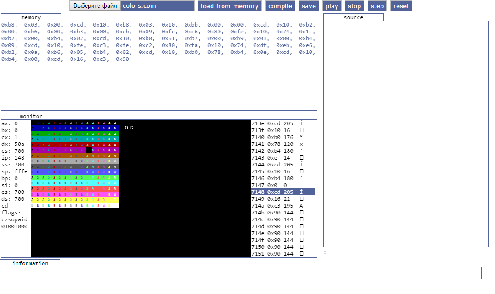

# JavaScript_emulator_for_Arduino8086

Port of the emulator for arduino [Arduino 8086 emulator](https://github.com/corax89/Arduino_8086_emulator)

Added debugger and simple compiler

You can see it [https://corax89.github.io/](https://corax89.github.io/)